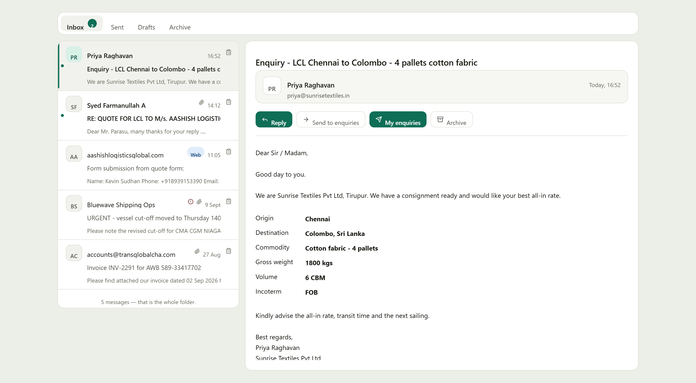
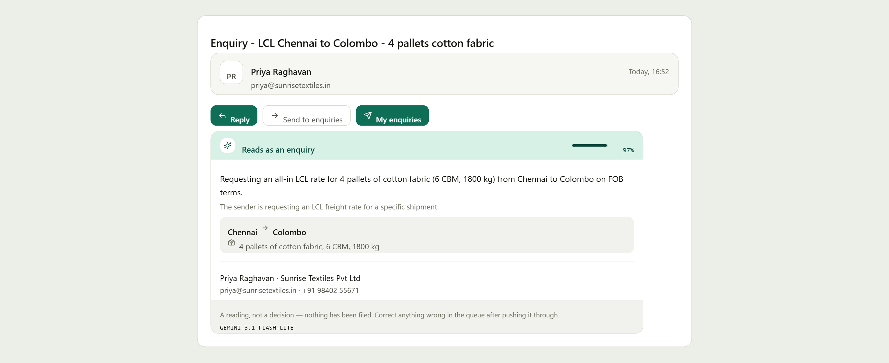
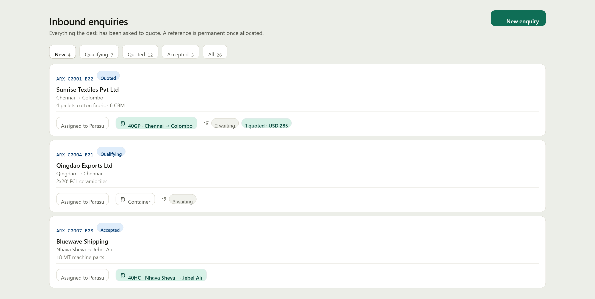
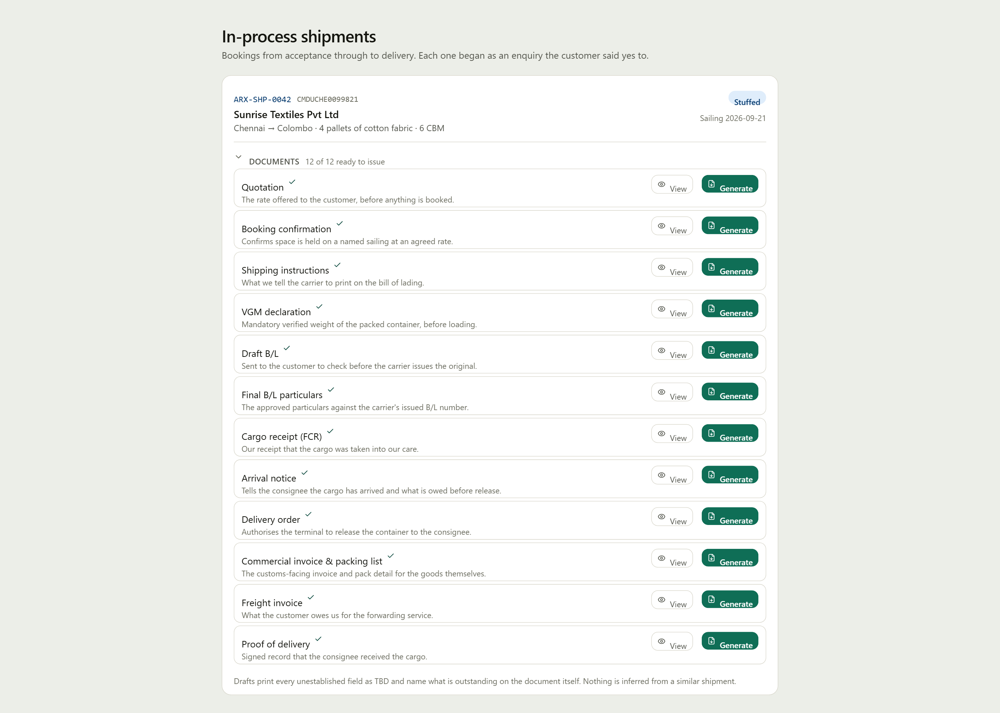

<div align="center">


# Aashish Logistics Global — freight desk

**An operations CRM for a freight forwarder, built around the mailbox.**

Enquiries arrive as email, get read, filed against a reference, put on a container,
sent to partners for a rate, and come out the other end as shipping documents.

<sub>React 18 · TypeScript · Vite · Tailwind · Supabase (Postgres + RLS + Edge Functions) ·
Microsoft Graph · Gemini</sub>

</div>

---

## The desk runs on mail

Everything starts in the inbox, so the inbox is in the CRM — real Outlook through
Microsoft Graph, with a delegated token that can only ever reach the signed-in person's
own mailbox.



Folders run across the top rather than down the side: as a column they cost 168px of width
permanently to show four items that never change. Horizontally they give that width back
to the two panes that actually hold something.

## Reading a message

**Read this** asks a model what a message is and what is in it. It answers one question —
is this an enquiry — and pulls out the fields the intake queue already has slots for.



It proposes; a person confirms. Nothing is filed until somebody presses a button, because
a reference is permanent and the correspondence attached to it is the record of what a
customer was told.

The layout follows the question rather than the schema. On a freight desk the question is
*where is it going, what is it, who is asking* — so the route reads as a route, the cargo
sits with it, and the contact details group as a person. A field the model did not find is
absent, not blank: an empty row invites reading it as "no origin" when it means "the
message did not say".

## The board

Every enquiry the desk has been asked to quote, who is handling it, what it is travelling
on, and how the partner rate requests are going.



A rate request goes to each partner **separately**, never as one mail with six recipients —
six recipients is one conversation, so every reply would thread together and no rate could
be attributed to the agent who sent it. It also means none of them sees who else was asked.

Replies are matched on the conversation id, the only identifier that survives the round
trip: subjects get rewritten, and agents reply from shared mailboxes rather than the
address you wrote to.

## Documents

Twelve documents, from the quotation through to proof of delivery, generated as PDFs from
whatever the record actually holds.



The rules that matter are about honesty, and they are enforced in one place:

- A field nobody established prints **TBD**, in grey, and is never inferred.
- A document missing anything it requires is stamped **DRAFT** and lists what is
  outstanding, by name, on the document itself.
- Nothing is presented as signed or issued by an authority that has not signed it.

That draft is not a failure state — it is what the desk sends to chase the missing detail.

---

## Where the intelligence is, and where it deliberately is not

Three things call a model, all through one Edge Function so the API key never reaches a
browser:

| | What it does |
|---|---|
| **Read this** | Classifies a message and extracts the enquiry fields |
| **Draft a reply** | Writes a reply in the compose box, to an optional brief |
| **Reading a rate** | Pulls the amount, transit and validity out of a partner's reply |

**The partner rate request is not one of them.** It is a deterministic template built from
the enquiry's own fields, because a request that guessed at a volume would have agents
quoting against cargo that does not exist. *Write it with AI* is there as an opt-in that
asks for a brief, and one press puts the standard request back.

Every prompt carries the same rule in the strongest terms available: **never state a figure
that is not in the source**. A wrong classification costs ten seconds; an invented rate
goes to a customer in writing over an employee's name.

## What is deterministic on purpose

Some things look like a job for a model and are not:

- **The forward chain** — who forwarded a mail and who originally sent it. Written into the
  message by Exchange in fields with fixed names; a fact to be read, not a judgement to be
  made.
- **Website form submissions** — a known layout, read with regular expressions. Faster,
  free, and it cannot hallucinate.
- **The reply greeting** — and it never writes *Mr.* or *Ms.*, because that means guessing
  someone's gender from their name and the desk writes to agents across a dozen countries.

---

## Running it

```bash
npm install
npm run dev            # http://localhost:5174
npm run build          # tsc -b, vite build, then a bundle secret scan
npm test               # every suite
```

The build fails if a credential reaches the bundle — `scripts/check-bundle-secrets.mjs`
scans the output, and it runs as part of `build` rather than as a step somebody can skip.

### Database

Migrations are plain SQL in `supabase-v2/`, applied through the Management API because the
Supabase CLI is not installed on the desk machines:

```bash
node supabase-v2/run-sql.mjs 028-booking-documents.sql
node supabase-v2/deploy-function.mjs classify-enquiry --verify-jwt
```

`--verify-jwt` matters for any function the browser calls: without it the URL is open to
anyone who finds it, and this one spends money per request.

### A case to look at

```bash
node supabase-v2/seed-showcase.mjs you@example.com
```

Creates one complete case — customer, enquiry, container, booking, and a partner at the
address you give — so the rate request can actually be answered and watched coming back.
Every row is an upsert on a `DEMO-` id, so it is safe to run twice.

## Tests

Pure logic is tested; the UI is not. Each suite covers something whose failure would be
invisible on screen:

| Suite | What it pins down |
|---|---|
| `test:space` | Cargo fitting in three dimensions, including the tall crate volume maths gets wrong |
| `test:web` | Reading a website form submission without inventing a field |
| `test:fwd` | The forward chain, and refusing to call an ordinary reply a forward |
| `test:apply` | Applying a reading to a queued row fills blanks and never overwrites |
| `test:greet` | Addressing somebody correctly — titles, initials, particles, surname-first |
| `test:scene`, `test:fields` | 3D projection, and the field catalogue |

## Layout

```
src/
  pages/          one per route
  components/     panels and dialogs
  services/       Supabase and Graph; every network call lives here
  lib/            pure logic — documents, greeting, initials
supabase-v2/      numbered SQL migrations, Edge Functions, seed scripts
scripts/tests/    the suites above
docs/images/      the screenshots in this file
```

---

<div align="center">
<sub>Built by <b>Araxys</b> for Aashish Logistics Global.</sub>
</div>
